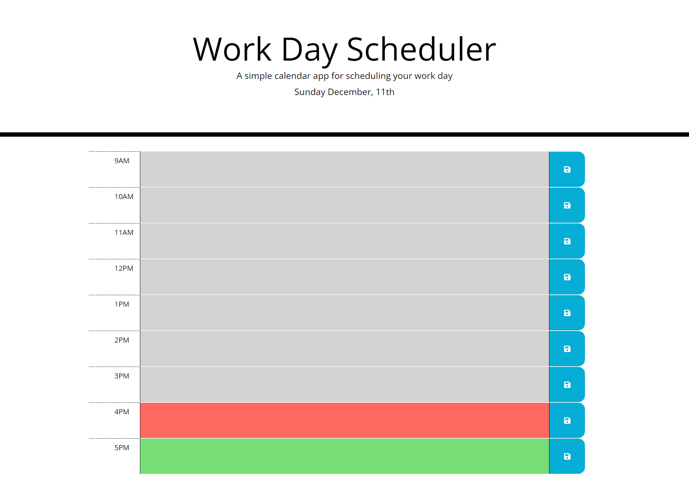

# Work Day Scheduler

## Description

The Work Day Scheduler allows you to enter tasks into specific time slots so that you can arrange your working day and remind yourself of the tasks you need to complete and when you need to complete them.

HTML, CSS and JavaScript were used for this project, as well as some third-party APIs, jQuery, BootStrap, FontAwesome, and Moment.js.

I needed to go over the documentation for Bootstrap, just to remind myself how to use it, as it has been a little while since last using.

The biggest challenge I had in this project was trying to find an easy way to find an index of an array containing a certain value.  I found MDN didn't explain very well how to do this or how to use the methods, so I found an article, which I have put in the Credits section, that helped explain how to use these.

Trying to customise CSS when using BootStrap proved slightly difficult, I had to use specificity rules to try and overrule some of the CSS coming from BootStrap.

Features I think should be added to this project are, a delete button on each row, so that each hours content can be cleared easily.  A clear button could also be added so that all hours tasks are cleared with the click of one button and a save all button could be advantageous, so if the user wants to add several tasks to different hours, instead of clicking each individual save button, they can just click the save all button.

## Table of Contents

- [Installation](#installation)
- [Usage](#usage)
- [Credits](#credits)
- [License](#license)

##  Installation

The Work Day Scheduler app can be found at this link: 
[Work Day Scheduler](https://nickmbk.github.io/work-day-scheduler/)

## Usage

When the page loads you will be presented with the Work Day Scheduler.

At the top you will see today's day and date displayed.

You are then presented with 9 time blocks, one for each hour from 9am - 5pm.

To log an activity or task, simply click in the center box of the hour you wish to set a task for and type what your task is, click the save button at the end of the text area to save your task.

To remove a task, click into the relevant box and delete the text and click the save icon again.

## Credits

Resources used in this project were:

[Bootstrap Documentation](https://getbootstrap.com/docs/4.3/getting-started/introduction/)

[jQuery Documentation](https://api.jquery.com/)

[Moment.js Documentation](https://momentjs.com/docs/)

[FontAwesome Documentation](https://fontawesome.com/)

I had an issue with trying to find the index of a specific value in an array, this article helped
[JavaScript Array](https://bobbyhadz.com/blog/javascript-array-find-index-of-object-by-property)

## License

I used no license for this project.